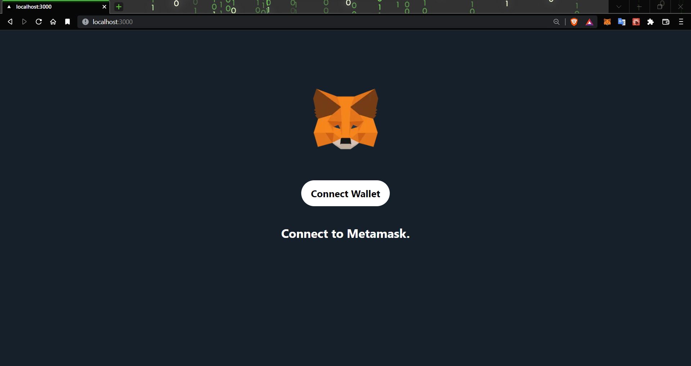
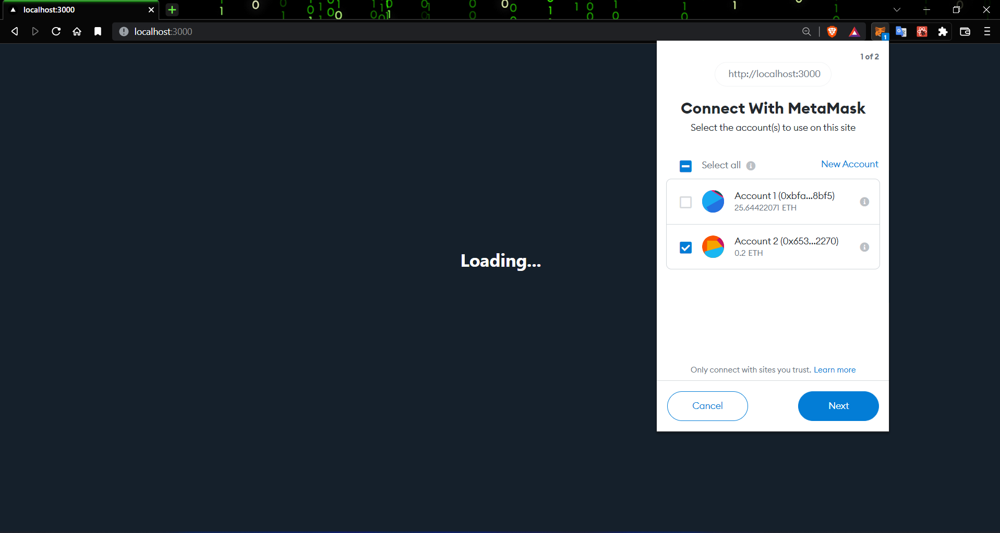

<h1 align="center">Face Mask Detection</h1>

<div align= "center">
  <h3>Twitter 3.0 with Blockchain and Smart Contract Technology</h3>
</div>

<div align="center">
    <a href="https://twitter.com/home"></a>
     <a href="https://github.com/Chaganti-Reddy/">
    <a href="https://github.com/Chaganti-Reddy/"></a>
</div>

----

## :star: Features

- **Authentication using MetaMask:**  We are using MetaMask for Authentication.
<div align= "center"></div>

----
## :warning: Frameworks and Libraries

- **[NextJS](https://nextjs.org/) :** Next.js is a JavaScript framework built with react js, webpack, and babel. Next.js helps the developer easily create a static generation (SSG) and server-side rendering (SSR) website.
  
- **[Solidity](https://docs.soliditylang.org/en/latest/) :**
  Solidity is an object-oriented, high-level language for implementing smart contracts. Smart contracts are programs which govern the behaviour of accounts within the Ethereum state.
- **[Tailwind CSS](https://tailwindcss.com/) :** Tailwind CSS is basically a Utility first CSS framework for building rapid custom UI. It is a highly customizable, low-level CSS framework that gives you all of the building blocks that you need. 
- **[Vercel](https://vercel.com/) :** Vercel integrate directly with GitHub or GitLab as well. It allows developers to host static websites and web applications that deploy upon every push in branches or merge/pull requests to preview changes live
- **[MetaMask](https://metamask.io/download/) :**
  •	MetaMask is a browser plugin that serves as an Ethereum wallet.

----

## 🚀&nbsp; Installation

1. Clone the repo

```
$ git clone https://github.com/Chaganti-Reddy/twitter3.0.git
```

2. Change your directory to client folder

```
$ cd client
```

3. Now, run the following command in your Terminal/Command Prompt to install the libraries required

```
$ yarn install

```
2. Change your directory to studio folder

```
$ cd .. && cd studio
```

3. Now, run the following command in your Terminal/Command Prompt to install the libraries required

```
$ yarn install

```
2. Change your directory to smart-contracts folder

```
$ cd .. && cd smart-contracts
```

3. Now, run the following command in your Terminal/Command Prompt to install the libraries required

```
$ yarn install

```

## :bulb: How to Run

1. Open terminal. Go into the client directory and type the following command:

```
$ yarn dev
```
## :key: Results

#### MetaMask Authentication

<div align= "center">

<div align= "center">

####

</img>

#### We got the following accuracy/loss training curve plot(for less no.of attempts)

#### We will get more accuracy if we try more no.of epochs(attempts)


## :clap: And it's done!

Feel free to mail me for any doubts/query
:email: chagantivenkataramireddy1@gmail.com

---

## :raising_hand: Citation

You are allowed to cite any part of the code or our dataset. You can use it in your Research Work or Project. Remember to provide credit to the Maintainer Chaganti Reddy by mentioning a link to this repository and her GitHub Profile.

Follow this format:

- Author's name - Chaganti Reddy
- Date of publication or update in parentheses.
- Title or description of document.
- URL.

## :beginner: Future Goals

1. Integrate This Project with Voice System.
2. Creating Android and IOS application of Face-Mask-Detector
3. Improving the training of model for low end camera.
4. Adding the Email Sending feature to Face-Mask-Detector.

## :heart: Owner

Made with :heart:&nbsp; by [Chaganti Reddy](https://github.com/Chaganti-Reddy/)

## :eyes: License

MIT © [Chaganti Reddy](https://github.com/Chaganti-Reddy/Face-Mask-Detector/blob/main/LICENSE)
